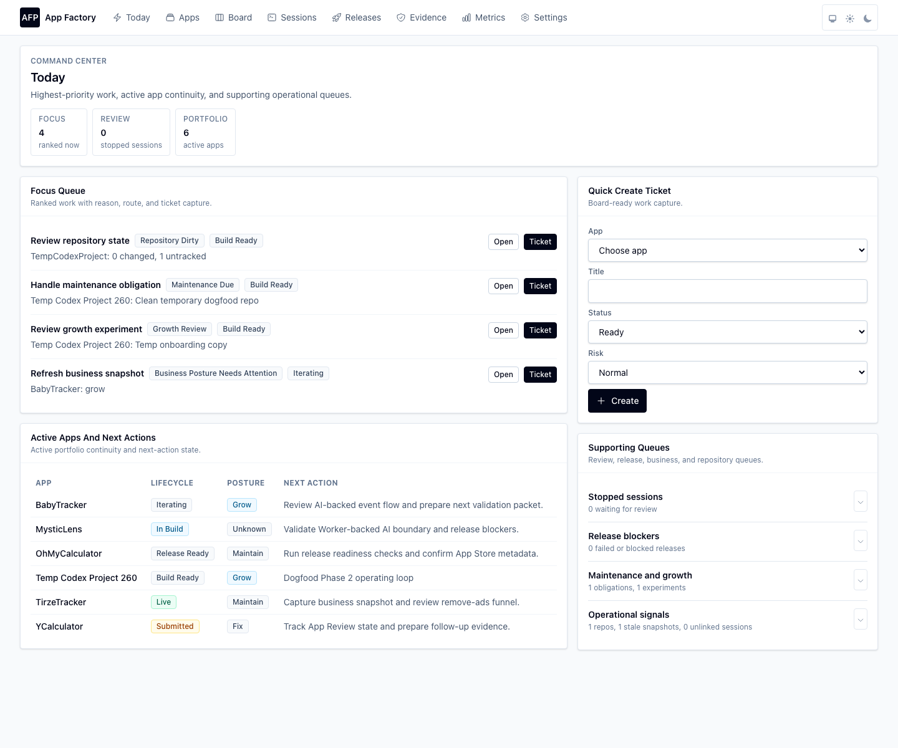
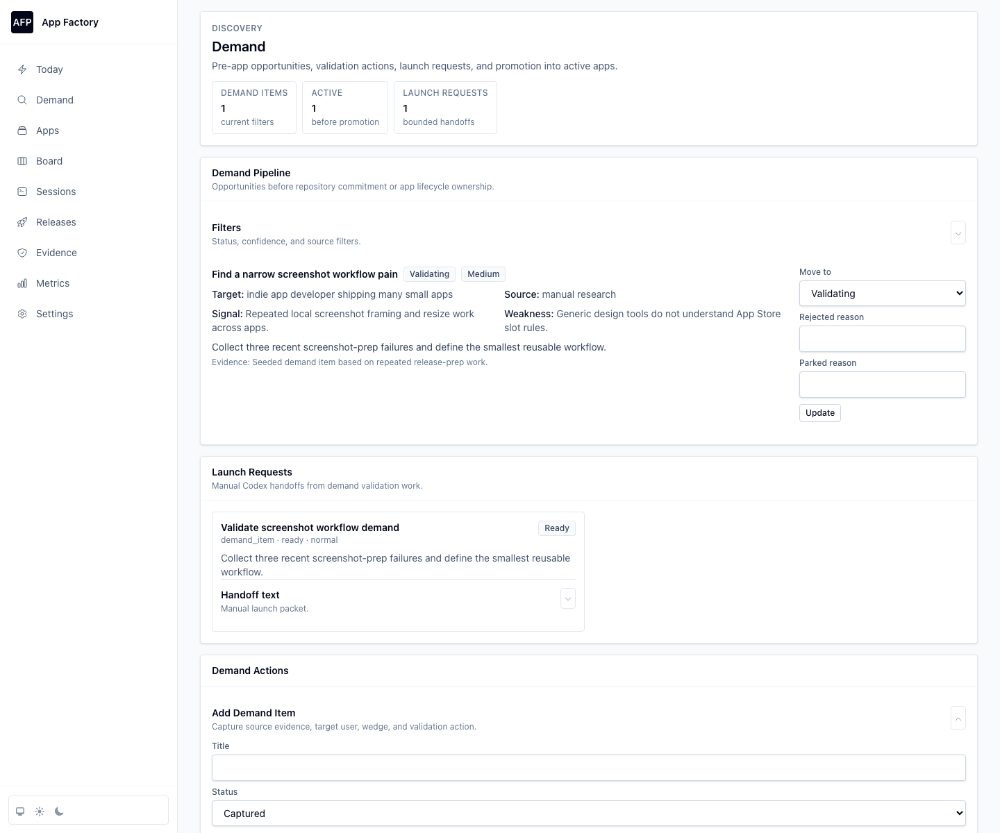
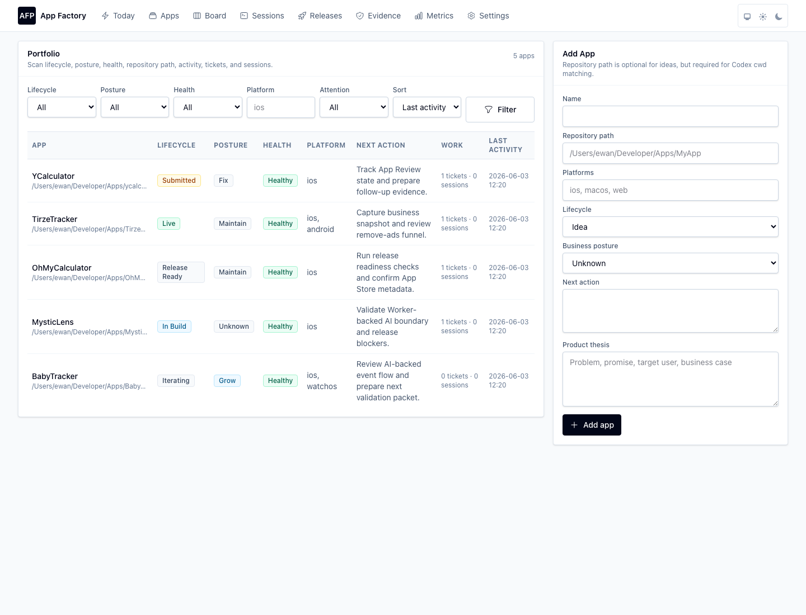
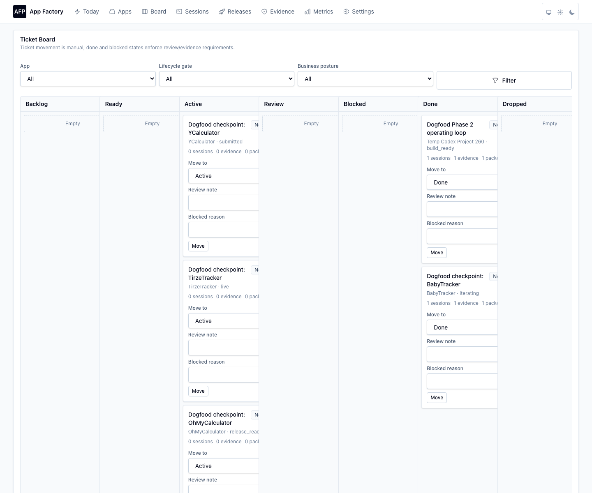
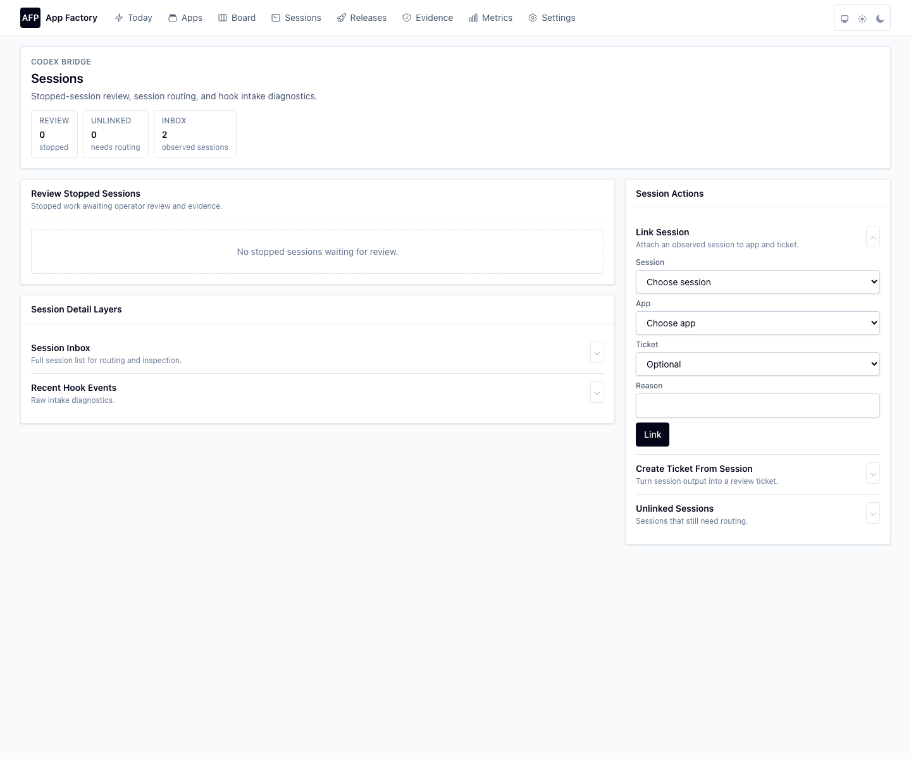
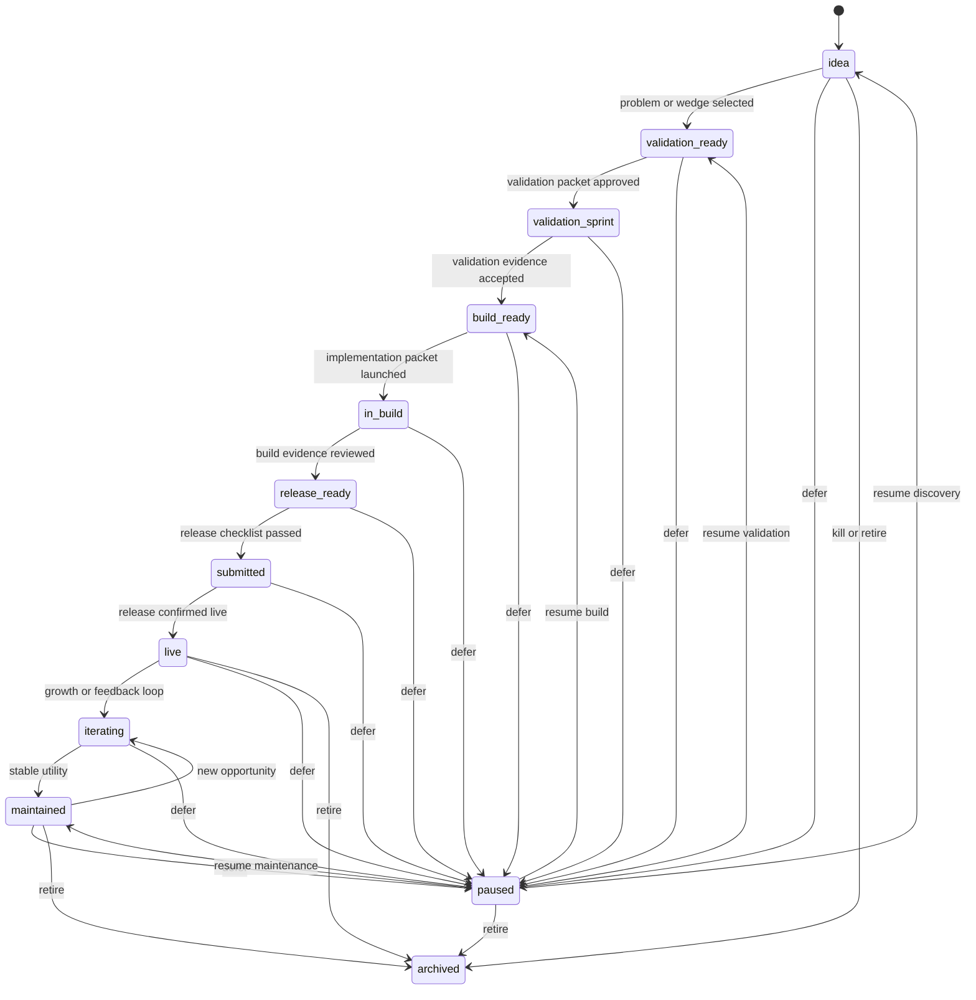
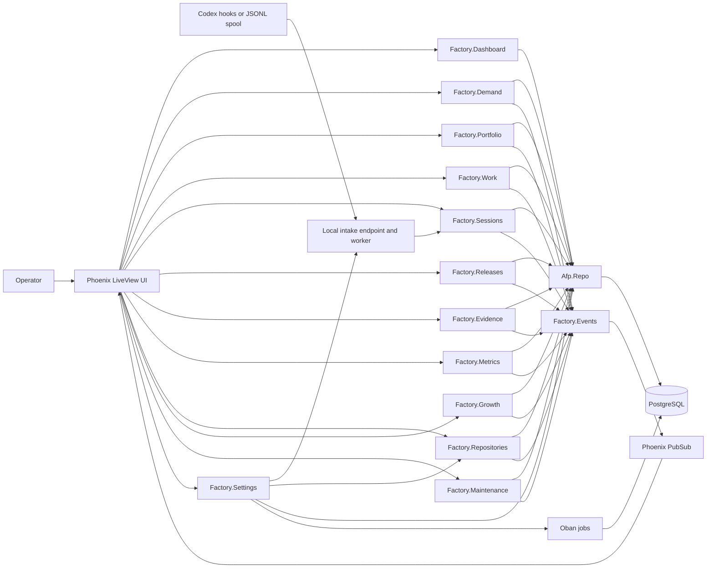
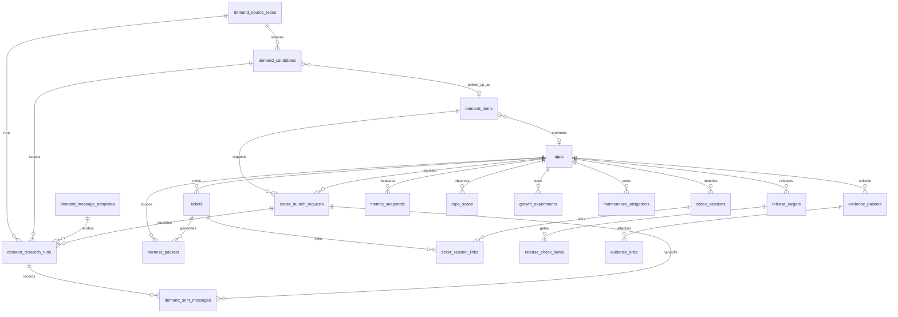

# App Factory Control Plane

Local-first Phoenix LiveView control plane for running a one-person app factory.
It tracks pre-app demand, a portfolio of small app projects, lifecycle state,
next action, work tickets, harness packets, Codex sessions, release readiness,
evidence, and business metrics.

The app is intentionally operational rather than promotional: open it, see what
needs attention today, route work into a bounded packet, review Codex output,
attach evidence, and decide whether an app or release is allowed to advance.

## Product Preview



| Demand Pipeline | Portfolio |
| --- | --- |
|  |  |

| Work Board | Codex Sessions |
| --- | --- |
|  |  |

## What It Manages

- Portfolio inventory: app name, repository path, platform, lifecycle stage,
  business posture, health state, current version/build, and next action.
- Demand management: pre-app opportunities, source evidence, target user/job,
  validation action, bounded Codex launch requests, and promotion into apps.
- Demand source repositories: external research repos that keep detailed scans,
  evidence, candidate reports, product packages, prototype assets, and required
  repo-local SQLite data while AFP indexes and routes their state through
  manifest-declared read operations. Manifest-missing legacy AppIdeas/GameIdeas
  layouts are detected but remain blocked until the operator adopts or repairs
  the source contract.
- Execution flow: tickets, review states, blocked reasons, and harness packets
  that describe context, constraints, verification, required evidence, and
  routing.
- Codex bridge: local HTTP hook intake and JSONL spool import, with explicit
  linking from detected sessions to apps and tickets.
- Release control: release targets, checklist gates, evidence attachment, and
  manual transitions from draft to live.
- Evidence and metrics: reusable evidence packets, many-object evidence links,
  manual business snapshots, and stale metric flags for live apps.
- Dogfood operating loop: local repository scans, copyable harness handoffs,
  review-time evidence capture, growth experiment reviews, and maintenance
  obligations.

## App Lifecycle Management

The lifecycle is app-first. Tickets, sessions, releases, and evidence orbit the
app record, but they do not automatically advance it. Lifecycle movement stays
manual so the operator can confirm business intent, review quality, and preserve
context before changing the portfolio state.



Lifecycle decisions are supported by adjacent state, not replaced by it:

- `business_posture` says why the app deserves attention: `grow`, `maintain`,
  `fix`, `harvest`, `pause`, or `kill`.
- `health_state` says what is wrong operationally: missing next action, missing
  repo, release blocked, review needed, stale metrics, or archived.
- `next_action` is the human-readable command that feeds Today and can be turned
  into a ticket.
- Release state is separate from app lifecycle. A release can be blocked while
  the app remains `release_ready`, and a submitted release only becomes `live`
  after an explicit operator decision.

## System Architecture

The system is a Phoenix app with PostgreSQL as the source of truth. LiveViews are
thin UI surfaces over Factory contexts; contexts own validation, state rules,
events, and PubSub notifications.



## Data Model



See [`docs/database_schema.md`](docs/database_schema.md) for table-level
details. Hook events and settings are also persisted, but they are processing and
configuration records rather than direct ownership edges in the core domain.

## Phase 2 Dogfood Loop

Phase 2 adds the daily operating loop needed for real dogfooding:

- **Repository scanning** reads configured roots and app repo paths, records git
  branch, dirty counts, latest commit, platform hints, and app health signals.
- **Harness handoff** turns a packet into copyable execution text for Codex while
  preserving the rule that AFP tickets only advance after manual review.
- **Review evidence** can be captured directly while reviewing a stopped Codex
  session, then linked back to the session and ticket.
- **Lifecycle and posture evidence** can be recorded during app state decisions.
- **Growth experiments** and **maintenance obligations** feed Today when review
  or due dates need attention.

See [`docs/phase-2-dogfood-operating-loop.md`](docs/phase-2-dogfood-operating-loop.md)
for the Phase 2 scope and verification contract.

See [`docs/demand-repo-control-plane-design.md`](docs/demand-repo-control-plane-design.md)
for the demand source repository contract, human-in-loop gates, scheduled and
manual research flows, package handoff, and required repo-local SQLite boundary.

## Main Surfaces

- **Today**: focus queue as the primary command surface, with supporting review,
  demand, release, business, repository, and session queues grouped below it.
- **Demand**: upstream demand-source console first, with configured research
  repos, scheduled due-scan drafts, manual idea/URL research handoffs, candidate
  pickup, product packages, package-file verification, launch requests,
  existing-session follow-ups, and promotion into apps kept as human-confirmed
  action layers.
- **Apps**: portfolio table as the primary read model, with filters and app
  creation separated into lower-level controls.
- **Board**: draggable ticket board as the primary work surface, with harness
  packet creation and handoff history in secondary action layers.
- **Sessions**: stopped-session review first, with full inbox, linking, and hook
  diagnostics grouped as lower-level context.
- **Releases**: release target summary first, with checklist gates and transition
  controls nested under each release.
- **Evidence**: proof packet store first, with capture and optional linking
  separated into action layers.
- **Metrics**: stale live-app metrics first, with historical snapshots and
  extended metric fields nested below.
- **Settings**: repository scope first, with Codex intake, import controls, and
  scan history grouped as operational sublayers.

## Information Hierarchy

The UI is organized around a consistent reading order:

- Global sidebar: persistent navigation and theme controls stay beside the
  working surface instead of competing with page content above it.
- Page header: what this screen is for and the few counters that orient the user.
- Primary area: the one thing the user is most likely to read or decide from.
- Secondary layers: related queues, history, diagnostics, and advanced fields in
  collapsible groups.
- Action rail: creation and mutation forms grouped separately from the primary
  read model.

## Running Locally

1. Run `mix setup` to install dependencies, create and migrate the PostgreSQL
   database, and build assets.
2. Start Phoenix with `mix phx.server` or `iex -S mix phx.server`.
3. Open [`localhost:4000`](http://localhost:4000). The app loads the Today
   command center.

Seed data includes one demand item and launch request, five local apps when
those repositories are present, plus a dogfood ticket, harness packet, Codex
session, release target, evidence packet, and metrics snapshot.

## Codex Hook Intake

The local HTTP receiver is:

```text
POST http://127.0.0.1:4000/api/codex/hooks
```

It stores raw hook payloads before processing and updates or creates Codex
session rows by `session_id`. JSONL spool import is configured in Settings and
uses stored byte offsets to avoid duplicate imports.

## Development Notes

- Run `mix precommit` before committing changes.
- Keep generated screenshots in `docs/screenshots/` when README visuals need to
  reflect current UI.
- Keep root docs and [`docs/database_schema.md`](docs/database_schema.md) aligned
  with data model or architecture changes.
