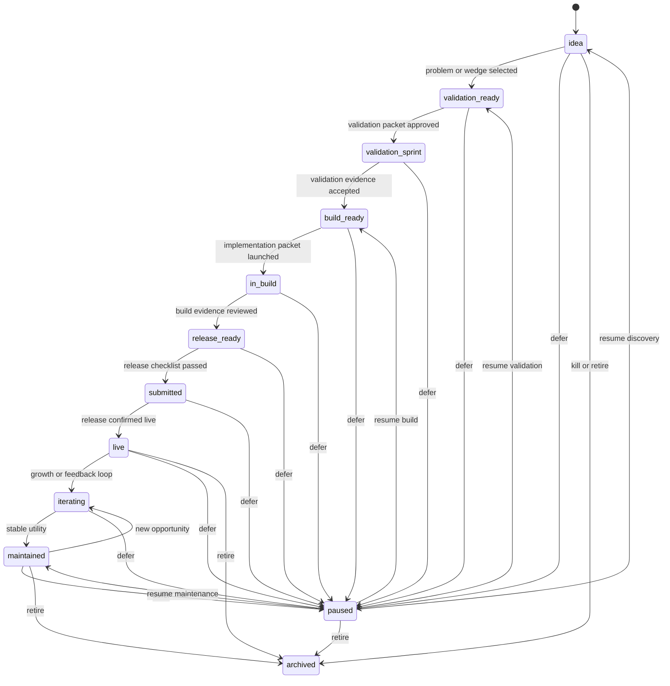
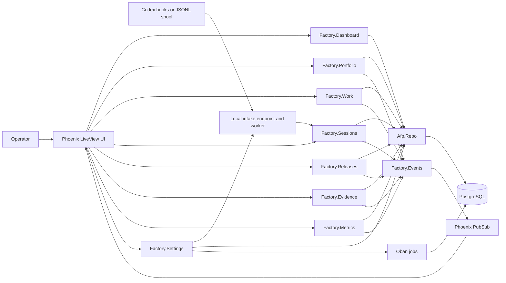
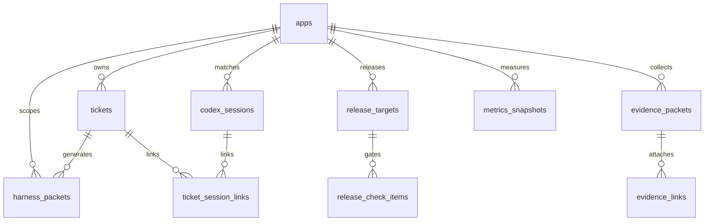

# App Factory Control Plane

Local-first Phoenix LiveView control plane for running a one-person app factory.
It tracks a portfolio of small app projects across lifecycle state, next action,
work tickets, harness packets, Codex sessions, release readiness, evidence, and
business metrics.

The app is intentionally operational rather than promotional: open it, see what
needs attention today, route work into a bounded packet, review Codex output,
attach evidence, and decide whether an app or release is allowed to advance.

## Product Preview


| Portfolio | Work Board |
| --- | --- |
|  |  |

| Codex Sessions |
| --- |
|  |

## What It Manages

- Portfolio inventory: app name, repository path, platform, lifecycle stage,
  business posture, health state, current version/build, and next action.
- Execution flow: tickets, review states, blocked reasons, and harness packets
  that describe context, constraints, verification, required evidence, and
  routing.
- Codex bridge: local HTTP hook intake and JSONL spool import, with explicit
  linking from detected sessions to apps and tickets.
- Release control: release targets, checklist gates, evidence attachment, and
  manual transitions from draft to live.
- Evidence and metrics: reusable evidence packets, many-object evidence links,
  manual business snapshots, and stale metric flags for live apps.

## App Lifecycle Management

The lifecycle is app-first. Tickets, sessions, releases, and evidence orbit the
app record, but they do not automatically advance it. Lifecycle movement stays
manual so the operator can confirm business intent, review quality, and preserve
context before changing the portfolio state.



Lifecycle decisions are supported by adjacent state, not replaced by it:

- `business_posture` says why the app deserves attention: `grow`, `maintain`,
  `fix`, `harvest`, `pause`, or `kill`.
- `health_state` says what is wrong operationally: missing next action, missing
  repo, release blocked, review needed, stale metrics, or archived.
- `next_action` is the human-readable command that feeds Today and can be turned
  into a ticket.
- Release state is separate from app lifecycle. A release can be blocked while
  the app remains `release_ready`, and a submitted release only becomes `live`
  after an explicit operator decision.

## System Architecture

The system is a Phoenix app with PostgreSQL as the source of truth. LiveViews are
thin UI surfaces over Factory contexts; contexts own validation, state rules,
events, and PubSub notifications.



## Data Model



See [`docs/database_schema.md`](docs/database_schema.md) for table-level
details. Hook events and settings are also persisted, but they are processing and
configuration records rather than direct ownership edges in the core domain.

## Main Surfaces

- **Today**: focus queue, stopped sessions, unlinked sessions, release blockers,
  stale metrics, and quick ticket creation.
- **Apps**: lifecycle/posture/health filters, portfolio table, app creation, and
  app detail cockpit.
- **Board**: manual ticket workflow, lifecycle gate filters, review notes, and
  evidence-aware done/blocked transitions.
- **Sessions**: Codex hook/session inbox, app matching, linking, review, ignore,
  and ticket creation from a session.
- **Releases**: release targets, checklist gates, evidence attachment, and
  operator-controlled release transitions.
- **Evidence**: manual evidence packets and links to apps, tickets, sessions,
  releases, checklist items, and metrics.
- **Metrics**: manual business snapshots and stale-live-app flags.
- **Settings**: repository roots, Codex intake mode, transcript privacy defaults,
  and JSONL spool offsets.

## Running Locally

1. Run `mix setup` to install dependencies, create and migrate the PostgreSQL
   database, and build assets.
2. Start Phoenix with `mix phx.server` or `iex -S mix phx.server`.
3. Open [`localhost:4000`](http://localhost:4000). The app loads the Today
   command center.

Seed data includes five local apps when those repositories are present, plus a
dogfood ticket, harness packet, Codex session, release target, evidence packet,
and metrics snapshot.

## Codex Hook Intake

The local HTTP receiver is:

```text
POST http://127.0.0.1:4000/api/codex/hooks
```

It stores raw hook payloads before processing and updates or creates Codex
session rows by `session_id`. JSONL spool import is configured in Settings and
uses stored byte offsets to avoid duplicate imports.

## Development Notes

- Run `mix precommit` before committing changes.
- Keep generated screenshots in `docs/screenshots/` when README visuals need to
  reflect current UI.
- Keep root docs and [`docs/database_schema.md`](docs/database_schema.md) aligned
  with data model or architecture changes.
