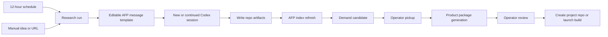

<!-- If files in this folder change, update this document. -->

# Demand Repo Control Plane Design

This document defines the v0 design for turning `/demand` into the upstream
control surface for demand discovery, product research, product-package
generation, and handoff into app or game development.

## Purpose

`/demand` is the beginning of the app factory lifecycle. It should answer:

- What opportunities have been researched recently?
- Which opportunities were rejected, parked, watched, or promoted?
- Which opportunities deserve deeper research or a validation sprint?
- Which product package is ready to hand to the next control-flow stage?
- Which Codex session produced or is producing each artifact?

AFP remains the control plane. It keeps orchestration records, run status,
operator decisions, Codex launch requests, session links, and promoted app
links. Detailed opportunity materials live in demand source repositories.

App ideas and game ideas can live in the same demand source repository. They
produce different package artifacts, but after pickup they use the same AFP
lifecycle: research, validate, package, create project repository, launch
implementation, review, release, iterate, maintain, or archive.

## Core Boundary

AFP stores minimal control-plane state:

- configured demand source repositories
- indexed candidate summaries
- research run metadata
- operator pickup decisions
- launch requests and Codex session links
- app/game promotion links
- review notes and routing decisions

Demand source repositories store project-specific or opportunity-specific
material:

- source checklists and scoring models
- market scans and research runs
- evidence logs
- candidate records
- deep reports
- product design packages
- prototype images and design kits
- repo-local SQLite databases for queryable research data
- repo-specific `AGENTS.md` instructions and skill requirements

Markdown and committed files remain the durable, reviewable artifact layer.
SQLite is the repo-local structured data layer. It supports query/update needs
that are specific to a given demand repo while Markdown remains the durable
review surface.

## Human-In-Loop Gates

AFP can schedule, launch, and observe research work, but meaningful lifecycle
advancement stays operator-confirmed.

Automatic or low-risk actions:

- run scheduled market scans
- create draft research runs
- write research artifacts to an existing demand repo
- refresh the AFP index from demand repo files
- produce recommended next actions
- create draft Codex launch requests
- draft follow-up messages for existing Codex sessions

Operator-confirmed actions:

- mark a candidate as the active validation sprint
- send a new or follow-up message to Codex
- generate a full product package from a candidate
- create a new app or game project repository
- start implementation work in a new or existing project repository
- promote a demand candidate into an AFP app record
- advance app lifecycle state
- archive, reject, or supersede a product package

The default Codex launch mode remains `manual_handoff`. Direct Codex App
Service execution can be added behind the same launch-request contract, but it
must not bypass these gates.

When AFP triggers Codex, Codex owns the concrete work inside the target repo:
reading repo guidance, applying skills, creating or editing artifacts, and
updating repo-local SQLite when required. AFP owns the launch contract, session
visibility, review gates, and routing decisions.

## Demand Source Repository Contract

Each demand source repository should declare a manifest at the repository root:

```json
{
  "schema_version": 2,
  "kind": "product_demand_repo",
  "display_name": "Product Demand",
  "description": "Unified demand research for apps and games.",
  "lanes": ["app", "game"],
  "agent_contract": {
    "entrypoint": "AGENTS.md",
    "required": true,
    "skill_policy": "repo_agents_first",
    "required_skills": [],
    "optional_skills": []
  },
  "read_order": [
    "AGENTS.md",
    "README.md",
    "sqlite/schema.sql",
    "config/*.md",
    "shared/**/*.md",
    "runs/**/*.md",
    "candidates/**/*.md",
    "packages/**/*.md",
    "evidence/**/*.md"
  ],
  "write_targets": {
    "runs": "runs",
    "candidates": "candidates",
    "evidence": "evidence",
    "reports": "reports",
    "packages": "packages"
  },
  "sqlite": {
    "path": "demand.sqlite3",
    "mode": "required",
    "owner": "repo",
    "schema_path": "sqlite/schema.sql",
    "migrations_path": "sqlite/migrations",
    "allowed_operations": [
      "read_index",
      "upsert_research_run",
      "upsert_candidate",
      "upsert_source",
      "upsert_score",
      "link_artifact"
    ]
  }
}
```

Suggested filename: `afp-demand-source.json`.

The manifest is intentionally small. It tells AFP how to read, where to write,
and how the required SQLite database is governed. The repo-specific research
method still lives in `AGENTS.md`, normal docs, templates, and skills.

## Recommended Repo Structure

Unified demand repo:

```text
afp-demand-source.json
AGENTS.md
README.md
config/
  sources.md
  scoring-model.md
sqlite/
  schema.sql
  migrations/
demand.sqlite3
runs/
  YYYY/
    MM/
      YYYY-MM-DD-<run-slug>.md
evidence/
  app/
    YYYY-MM-DD/
      <source-log>.md
  game/
    YYYY-MM-DD/
      <source-log>.md
candidates/
  app/
    <candidate-slug>.md
  game/
    <candidate-slug>.md
reports/
  app/
    YYYY-MM-DD-<candidate-slug>-report.md
  game/
    weekly-YYYY-Www.md
packages/
  app/
    <candidate-slug>/
      PRD.md
      VALIDATION_PLAN.md
      MVP_SCOPE.md
      DATA_MODEL.md
      UX_FLOW.md
      PROTOTYPE.md
      assets/
        prototype/
  game/
    <idea-slug>/
      PRD.md
      DESIGN_KIT.md
      IMPLEMENTATION_BRIEF.md
      assets/
        design/
          key-screens/
shared/
  competitor-index.md
  rejected-ideas.md
templates/
```

Existing AppIdeas and GameIdeas repositories can be migrated into this unified
shape, or temporarily read through legacy adapters. The unified repo is the
target contract because app and game candidates share lifecycle semantics even
when their package artifacts differ.

Legacy AppIdeas layout:

```text
README.md
config/
daily/
evidence/
reports/
memory/
templates/
```

Legacy GameIdeas layout:

```text
README.md
AGENTS.md
market/
ideas/
templates/
```

Legacy layouts are allowed only through explicit adapters. New repos should use
the unified contract.

## Repo Agent And Skill Contract

Every demand source repo must define an `AGENTS.md` file. AFP should not try to
fully encode repo-specific research rules in its own database because the actual
work is performed by Codex inside the repo.

`AGENTS.md` should define:

- repo purpose and source boundaries
- required read order before research
- app-lane and game-lane output rules
- required skills or plugin expectations
- SQLite update rules
- file naming and dated artifact rules
- validation-ready, validation-sprint, build-ready, and reject definitions
- human-confirmation points
- prohibited actions such as creating project repos or launching builds

When AFP launches or continues a Codex session, the launch message should point
Codex at the repo path and explicitly say to follow that repo's `AGENTS.md`.
AFP can choose a message template, but the repo owns the detailed operating
method.

If the manifest declares required skills, AFP should surface them in source
health. A missing skill does not mean the source repo is invalid, but it should
block scheduled runs that require that skill until the operator installs,
enables, or overrides the requirement.

## Normalized Read Model

AFP indexes repo material into a normalized read model. The indexed record is
not the source of truth for detailed content.

```elixir
%{
  source_repo_path: "/Users/ewan/Developer/Demand/ProductDemand",
  source_kind: "product_demand_repo",
  lane: "app",
  external_id: "skyview-observation-alignment-packet",
  title: "SkyView Observation Alignment Packet",
  source_status: "validation-ready",
  afp_status: "not_picked_up",
  score: 82,
  confidence: "medium-high",
  target_user: "...",
  demand_signal: "...",
  incumbent_weakness: "...",
  wedge_hypothesis: "...",
  validation_action: "...",
  primary_path: "candidates/app/skyview-observation-alignment-packet.md",
  report_path: "reports/app/2026-06-06-skyview-observation-alignment-packet-report.md",
  evidence_paths: ["evidence/app/2026-06-06/apple-skyview-ranked-demand.md"],
  observed_at: ~D[2026-06-06],
  limitations: "Apple top-grossing RSS returned 404."
}
```

`source_status` comes from the demand repo. `afp_status` is the operator's
control-plane state. AFP must keep these separate because a repo can mark an
idea `validation-ready` before the operator chooses to pick it up.

The `lane` field controls package type, not lifecycle. Both `app` and `game`
lanes map to the same AFP lifecycle after pickup.

## Research Flow



Scheduled runs and manual runs share the same run model. The difference is only
the input and cadence.

## Research Run Types

- `scheduled_scan`: recurring 12-hour scan across configured sources.
- `manual_idea`: free-form idea supplied by the operator.
- `manual_url`: App Store, competitor, product, game, or website URL supplied by
  the operator.
- `deep_research`: deeper work on an existing candidate.
- `package_generation`: PRD, validation plan, prototype, and design-kit output.
- `repo_audit`: structure detection or migration proposal for an unsupported
  demand repo.
- `session_continue`: follow-up instruction sent to an existing Codex session.

Every run should record:

- source repo
- run type
- input text or URL
- objective
- Codex launch request
- Codex session link
- message template id and rendered message
- output paths
- status
- errors or limitations
- operator review note

## 12-Hour Automation

AFP should schedule a recurring research pass for enabled demand source repos.
The default interval is 12 hours, but the operator can disable or adjust it per
source repo.

The scheduled pass should:

1. Read the source repo manifest.
2. Read the repo guidance in manifest order.
3. Render an operator-reviewable message template.
4. Start or continue a bounded Codex research run.
5. Require the run to follow `AGENTS.md` and write artifacts only inside
   configured write targets.
6. Require the run to update repo-local SQLite and summarize durable decisions
   back to Markdown.
7. Re-index the repo after the run.
8. Surface newly changed candidates in `/demand`.

The scheduled pass should not:

- create app or game project repositories
- start implementation work
- promote candidates into app records
- mark a candidate as `validation_sprint`
- overwrite product packages without a new version or operator approval

## Manual Idea Or URL Flow

The operator can enter:

- plain idea text
- App Store URL
- Google Play URL
- website URL
- GitHub repository URL
- competitor name
- keyword cluster
- existing local source path

AFP turns the input into a draft research launch request. The run should produce
a repo artifact that answers:

- What is the user job?
- What evidence proves demand?
- What incumbent weakness exists?
- What is the narrow wedge?
- What should be rejected or kept out of scope?
- What validation action is required?
- What would make this build-ready?
- Should this become a product package?

The operator decides whether to keep researching, reject, park, validate, or
generate a package.

## Codex Session Messaging

AFP needs a message-template layer because many launch and follow-up messages
will be similar.

Template examples:

- scheduled market scan
- manual URL opportunity analysis
- deep research for candidate
- package generation for app lane
- package generation for game lane
- repo structure audit
- continue session with reviewer feedback
- repair missing SQLite or manifest state
- create project-repo plan without executing it
- launch implementation after operator approval

Each template should store:

- name
- purpose
- default run type
- default lane
- default target: new session or existing session
- required variables
- rendered message body
- safety notes
- expected output paths
- required human confirmation before send

AFP should render the template with current context, then let the operator edit
the final message before sending. The sent message should be stored on the
research run or launch request so the session can be audited later.

New-session send:

1. Operator selects a source repo, run type, and template.
2. AFP renders the message with repo path, candidate id, lane, output paths, and
   constraints.
3. Operator edits and confirms.
4. AFP creates a Codex launch request and starts a new session through the Codex
   App Service adapter or manual handoff.
5. AFP links the resulting session to the run.

Continue-session send:

1. Operator selects an existing session.
2. AFP renders a follow-up template using the latest run state and review note.
3. Operator edits and confirms.
4. AFP sends the message to the existing session through the Codex App Service
   adapter or records the manual handoff.
5. AFP appends the sent message to the run history.

The adapter should hide Codex App Service transport details. The AFP domain
model should care only whether a message was drafted, confirmed, sent,
accepted, failed, or superseded.

## Product Package Output

When a candidate is approved for packaging, Codex writes a package folder in the
demand repo.

For app-lane ideas:

```text
packages/app/<candidate-slug>/
  README.md
  PRD.md
  VALIDATION_PLAN.md
  MVP_SCOPE.md
  DATA_MODEL.md
  UX_FLOW.md
  PROTOTYPE.md
  assets/
    prototype/
```

For game-lane ideas:

```text
packages/game/<idea-slug>/
  PRD.md
  DESIGN_KIT.md
  IMPLEMENTATION_BRIEF.md
  assets/
    design/
      key-screens/
```

The product package is the handoff artifact for the next control-flow stage.
Creating the actual implementation repository is a separate operator-confirmed
action.

## Missing Or Invalid Source Folders

AFP should handle source configuration problems explicitly.

No demand source repo configured:

- show an empty setup state on `/demand`
- offer actions to add an existing repo or create a new repo from a template
- do not run scheduled research

Configured path does not exist:

- mark the source `missing`
- keep prior indexed rows visible with a stale/offline warning
- block writes and scheduled runs for that source

Path exists but is not a git repository:

- mark the source `not_git`
- allow read-only inspection only if a manifest is present
- require operator confirmation before initializing or adopting it

Git repository exists but no manifest is present:

- try known legacy adapters such as AppIdeas or GameIdeas
- show the detected structure and confidence
- allow a `repo_audit` run to propose a manifest
- require operator confirmation before writing a manifest

Manifest exists but structure is invalid:

- mark the source `invalid_structure`
- show missing paths and parse errors
- allow a repo repair launch request
- do not mutate the repo except through an operator-confirmed repair action

Manifest exists but `AGENTS.md` is missing:

- mark the source `agents_missing`
- keep read-only indexing available if enough structure exists
- block scheduled write runs
- offer a repo audit or AGENTS generation launch request
- require operator confirmation before writing `AGENTS.md`

Required skills are unavailable:

- mark the source `skills_unavailable`
- show the missing skill names and the run types they affect
- block affected scheduled runs
- allow manual runs only after operator override
- prefer installing/enabling the skill over weakening the repo contract

Unsupported structure:

- keep it out of scheduled runs
- allow manual one-off research using it as context
- ask Codex to propose a migration plan instead of silently guessing

Missing or invalid SQLite:

- mark source health as `sqlite_missing` or `sqlite_invalid`
- keep Markdown inspection available
- block scheduled write runs until repaired
- allow a repair launch request that follows repo `AGENTS.md`
- require operator confirmation before creating or migrating the database

## Required Repo-Local SQLite

A demand repo must include a SQLite database for structured data that belongs to
that repo but does not belong in AFP lifecycle orchestration.

The goal is not to replace Markdown. The goal is to make recurring research,
deduplication, filtering, scoring, source tracking, and page rendering reliable
without scraping Markdown tables on every request.

Good SQLite uses:

- normalized competitor rows
- source crawl metadata
- public ranking snapshots
- review snippets or source observations
- deduplication tables
- search query history
- manual validation interview notes with local-only fields
- structured scoring breakdowns
- cached URL metadata
- artifact generation state specific to the source repo
- candidate-to-artifact links
- lane-specific package metadata
- source freshness and coverage status

Bad SQLite uses:

- AFP app lifecycle state
- Codex session ownership
- launch-request approval state
- cross-repo portfolio decisions
- release readiness
- data that must be visible without the source repo present

The source repo owns its SQLite schema. AFP may read and write it only through
operations declared by the manifest and implemented by the repo adapter. AFP
should not directly mutate arbitrary tables.

Minimum required tables, expressed conceptually:

- `research_runs`: repo-local run id, lane, run type, started/completed time,
  input, output paths, and status.
- `candidates`: candidate id, lane, title, status, score, confidence, current
  report path, package path, and latest decision.
- `sources`: source id, URL/path, source family, reliability, access status,
  and last observed time.
- `evidence_items`: source observation summaries linked to candidates.
- `scores`: per-dimension score rows with notes.
- `artifacts`: Markdown, image, package, and prototype paths with artifact type.
- `candidate_artifacts`: many-to-many links between candidates and artifacts.
- `schema_migrations`: repo-local SQLite migration tracking.

Suggested manifest extension:

```json
{
  "sqlite": {
    "path": "demand.sqlite3",
    "mode": "required",
    "owner": "repo",
    "schema_path": "sqlite/schema.sql",
    "migrations_path": "sqlite/migrations",
    "allowed_operations": ["read_candidates", "upsert_sources", "upsert_scores"]
  }
}
```

AFP should treat SQLite as the structured repo-local data layer, not as the
human review layer. Important decisions must be summarized back to Markdown so
the repo remains reviewable through Git.

## Data Ownership Rule

If data is needed to coordinate the app factory across repositories, it belongs
in AFP PostgreSQL. If data is only meaningful inside one research repo, it can
belong in that repo's files or SQLite database.

Examples:

- Candidate score: repo-owned, indexed by AFP.
- Operator pickup state: AFP-owned.
- Competitor table for AppIdeas: AppIdeas-owned.
- Codex session link for package generation: AFP-owned.
- Product package PRD: repo-owned.
- App lifecycle stage after promotion: AFP-owned.
- Message template catalog: AFP-owned.
- Rendered and sent session messages: AFP-owned, with source repo output paths
  linked back to repo-owned artifacts.

## `/demand` Page Shape

The page should become a control console with these primary sections:

- Source repos: configured sources, structure health, schedule, latest scan.
- Research runs: running, failed, and recently completed Codex work.
- Message templates: reusable launch and follow-up prompts with editable
  rendered messages.
- Candidate pool: indexed opportunities with status, score, freshness, and
  source.
- Pickup queue: candidates recommended for operator attention.
- Package queue: candidates approved for PRD/prototype/design package output.
- Handoff queue: packages ready to create a project repo or launch a build.

Candidate detail should show:

- normalized summary
- source paths
- report preview
- evidence paths
- score and confidence
- limitations
- Codex session history
- operator decisions
- next available actions
- draft message preview before new-session or continue-session send

## Implementation Slices

1. Unified manifest and legacy adapter spike: read existing AppIdeas and
   GameIdeas while defining the target unified demand repo contract.
2. Required SQLite slice: define the minimum repo-local schema, migrations, and
   adapter operations.
3. AFP persistence: add source repo, research run, message template, and sent
   message control-plane records.
4. `/demand` UI: show source health, candidates, runs, templates, and pickup
   actions.
5. Codex launch integration: render templates, create launch requests, start
   new sessions, continue existing sessions, and link session state.
6. Package handoff: generate app-lane or game-lane product packages and route
   approved packages to project creation.

The first implementation slice may use legacy adapters for existing repos, but
the target contract requires a manifest, `AGENTS.md`, and repo-local SQLite. It
should prove that AFP can read a unified demand repo, show candidates, let the
operator edit/send a Codex message, and pick up one candidate without moving
detailed content out of the repo.
