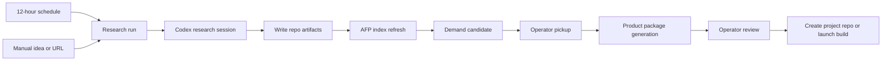

<!-- If files in this folder change, update this document. -->

# Demand Repo Control Plane Design

This document defines the v0 design for turning `/demand` into the upstream
control surface for demand discovery, product research, product-package
generation, and handoff into app or game development.

## Purpose

`/demand` is the beginning of the app factory lifecycle. It should answer:

- What opportunities have been researched recently?
- Which opportunities were rejected, parked, watched, or promoted?
- Which opportunities deserve deeper research or a validation sprint?
- Which product package is ready to hand to the next control-flow stage?
- Which Codex session produced or is producing each artifact?

AFP remains the control plane. It keeps orchestration records, run status,
operator decisions, Codex launch requests, session links, and promoted app
links. Detailed opportunity materials live in demand source repositories.

## Core Boundary

AFP stores minimal control-plane state:

- configured demand source repositories
- indexed candidate summaries
- research run metadata
- operator pickup decisions
- launch requests and Codex session links
- app/game promotion links
- review notes and routing decisions

Demand source repositories store project-specific or opportunity-specific
material:

- source checklists and scoring models
- market scans and research runs
- evidence logs
- candidate records
- deep reports
- product design packages
- prototype images and design kits
- optional repo-local SQLite databases for queryable research data

Markdown and committed files remain the durable, reviewable artifact layer.
SQLite is optional and supports local query/update needs that are specific to a
given demand repo.

## Human-In-Loop Gates

AFP can schedule, launch, and observe research work, but meaningful lifecycle
advancement stays operator-confirmed.

Automatic or low-risk actions:

- run scheduled market scans
- create draft research runs
- write research artifacts to an existing demand repo
- refresh the AFP index from demand repo files
- produce recommended next actions
- create draft Codex launch requests

Operator-confirmed actions:

- mark a candidate as the active validation sprint
- generate a full product package from a candidate
- create a new app or game project repository
- start implementation work in a new or existing project repository
- promote a demand candidate into an AFP app record
- advance app lifecycle state
- archive, reject, or supersede a product package

The default Codex launch mode remains `manual_handoff`. Direct Codex App
Service execution can be added behind the same launch-request contract, but it
must not bypass these gates.

## Demand Source Repository Contract

Each demand source repository should declare a manifest at the repository root:

```json
{
  "schema_version": 1,
  "kind": "app_ideas",
  "display_name": "AppIdeas",
  "description": "Ranked-demand research for small utility apps.",
  "read_order": [
    "README.md",
    "config/sources.md",
    "config/scoring-model.md",
    "memory/idea-index.md",
    "daily/*.md",
    "reports/*.md",
    "evidence/*/*.md"
  ],
  "write_targets": {
    "runs": "daily",
    "evidence": "evidence",
    "reports": "reports",
    "packages": "packages"
  },
  "sqlite": {
    "path": "demand.sqlite3",
    "mode": "optional",
    "owner": "repo"
  }
}
```

Suggested filename: `afp-demand-source.json`.

The manifest is intentionally small. It tells AFP how to read, where to write,
and whether an optional SQLite file exists. The repo-specific research method
still lives in normal docs and templates.

## Recommended Repo Structure

App opportunity repo:

```text
afp-demand-source.json
README.md
config/
  sources.md
  scoring-model.md
daily/
  YYYY-MM-DD-candidates.md
evidence/
  YYYY-MM-DD/
    <source-log>.md
reports/
  YYYY-MM-DD-<candidate-slug>-report.md
packages/
  <candidate-slug>/
    PRD.md
    VALIDATION_PLAN.md
    PROTOTYPE.md
    assets/
memory/
  idea-index.md
  competitor-index.md
  rejected-ideas.md
templates/
```

Game opportunity repo:

```text
afp-demand-source.json
README.md
market/
  README.md
  sources.yaml
  snapshots/
    YYYY-MM-DD.md
  candidates/
    <candidate-slug>.md
  reports/
    weekly-YYYY-Www.md
ideas/
  <idea-slug>/
    PRD.md
    DESIGN_KIT.md
    assets/
      design/
templates/
```

Repos can support additional structures, but they need either a manifest or a
repo-specific adapter.

## Normalized Read Model

AFP indexes repo material into a normalized read model. The indexed record is
not the source of truth for detailed content.

```elixir
%{
  source_repo_path: "/Users/ewan/Developer/Apps/AppIdeas",
  source_kind: "app_ideas",
  external_id: "skyview-observation-alignment-packet",
  title: "SkyView Observation Alignment Packet",
  source_status: "validation-ready",
  afp_status: "not_picked_up",
  score: 82,
  confidence: "medium-high",
  target_user: "...",
  demand_signal: "...",
  incumbent_weakness: "...",
  wedge_hypothesis: "...",
  validation_action: "...",
  primary_path: "daily/2026-06-06-candidates.md",
  report_path: "reports/2026-06-06-skyview-observation-alignment-packet-report.md",
  evidence_paths: ["evidence/2026-06-06/apple-skyview-ranked-demand.md"],
  observed_at: ~D[2026-06-06],
  limitations: "Apple top-grossing RSS returned 404."
}
```

`source_status` comes from the demand repo. `afp_status` is the operator's
control-plane state. AFP must keep these separate because a repo can mark an
idea `validation-ready` before the operator chooses to pick it up.

## Research Flow



Scheduled runs and manual runs share the same run model. The difference is only
the input and cadence.

## Research Run Types

- `scheduled_scan`: recurring 12-hour scan across configured sources.
- `manual_idea`: free-form idea supplied by the operator.
- `manual_url`: App Store, competitor, product, game, or website URL supplied by
  the operator.
- `deep_research`: deeper work on an existing candidate.
- `package_generation`: PRD, validation plan, prototype, and design-kit output.
- `repo_audit`: structure detection or migration proposal for an unsupported
  demand repo.

Every run should record:

- source repo
- run type
- input text or URL
- objective
- Codex launch request
- Codex session link
- output paths
- status
- errors or limitations
- operator review note

## 12-Hour Automation

AFP should schedule a recurring research pass for enabled demand source repos.
The default interval is 12 hours, but the operator can disable or adjust it per
source repo.

The scheduled pass should:

1. Read the source repo manifest.
2. Read the repo guidance in manifest order.
3. Start a bounded Codex research run.
4. Require the run to write artifacts only inside configured write targets.
5. Re-index the repo after the run.
6. Surface newly changed candidates in `/demand`.

The scheduled pass should not:

- create app or game project repositories
- start implementation work
- promote candidates into app records
- mark a candidate as `validation_sprint`
- overwrite product packages without a new version or operator approval

## Manual Idea Or URL Flow

The operator can enter:

- plain idea text
- App Store URL
- Google Play URL
- website URL
- GitHub repository URL
- competitor name
- keyword cluster
- existing local source path

AFP turns the input into a draft research launch request. The run should produce
a repo artifact that answers:

- What is the user job?
- What evidence proves demand?
- What incumbent weakness exists?
- What is the narrow wedge?
- What should be rejected or kept out of scope?
- What validation action is required?
- What would make this build-ready?
- Should this become a product package?

The operator decides whether to keep researching, reject, park, validate, or
generate a package.

## Product Package Output

When a candidate is approved for packaging, Codex writes a package folder in the
demand repo.

For app ideas:

```text
packages/<candidate-slug>/
  README.md
  PRD.md
  VALIDATION_PLAN.md
  MVP_SCOPE.md
  DATA_MODEL.md
  UX_FLOW.md
  PROTOTYPE.md
  assets/
    prototype/
```

For game ideas:

```text
ideas/<idea-slug>/
  PRD.md
  DESIGN_KIT.md
  IMPLEMENTATION_BRIEF.md
  assets/
    design/
      key-screens/
```

The product package is the handoff artifact for the next control-flow stage.
Creating the actual implementation repository is a separate operator-confirmed
action.

## Missing Or Invalid Source Folders

AFP should handle source configuration problems explicitly.

No demand source repo configured:

- show an empty setup state on `/demand`
- offer actions to add an existing repo or create a new repo from a template
- do not run scheduled research

Configured path does not exist:

- mark the source `missing`
- keep prior indexed rows visible with a stale/offline warning
- block writes and scheduled runs for that source

Path exists but is not a git repository:

- mark the source `not_git`
- allow read-only inspection only if a manifest is present
- require operator confirmation before initializing or adopting it

Git repository exists but no manifest is present:

- try known legacy adapters such as AppIdeas or GameIdeas
- show the detected structure and confidence
- allow a `repo_audit` run to propose a manifest
- require operator confirmation before writing a manifest

Manifest exists but structure is invalid:

- mark the source `invalid_structure`
- show missing paths and parse errors
- allow a repo repair launch request
- do not mutate the repo except through an operator-confirmed repair action

Unsupported structure:

- keep it out of scheduled runs
- allow manual one-off research using it as context
- ask Codex to propose a migration plan instead of silently guessing

## Optional Repo-Local SQLite

A demand repo may include a SQLite database for data that belongs to that repo
but does not belong in AFP lifecycle orchestration.

Good SQLite uses:

- normalized competitor rows
- source crawl metadata
- public ranking snapshots
- review snippets or source observations
- deduplication tables
- search query history
- manual validation interview notes with local-only fields
- structured scoring breakdowns
- cached URL metadata
- artifact generation state specific to the source repo

Bad SQLite uses:

- AFP app lifecycle state
- Codex session ownership
- launch-request approval state
- cross-repo portfolio decisions
- release readiness
- data that must be visible without the source repo present

The source repo owns its SQLite schema. AFP may read and write it only when the
manifest declares the database and the allowed tables or operations.

Suggested manifest extension:

```json
{
  "sqlite": {
    "path": "demand.sqlite3",
    "mode": "read_write",
    "owner": "repo",
    "allowed_operations": ["read_candidates", "upsert_sources", "upsert_scores"]
  }
}
```

AFP should treat SQLite as an acceleration and editing layer, not a replacement
for durable Markdown artifacts. Important decisions should be summarized back to
Markdown so the repo remains reviewable through Git.

## Data Ownership Rule

If data is needed to coordinate the app factory across repositories, it belongs
in AFP PostgreSQL. If data is only meaningful inside one research repo, it can
belong in that repo's files or SQLite database.

Examples:

- Candidate score: repo-owned, indexed by AFP.
- Operator pickup state: AFP-owned.
- Competitor table for AppIdeas: AppIdeas-owned.
- Codex session link for package generation: AFP-owned.
- Product package PRD: repo-owned.
- App lifecycle stage after promotion: AFP-owned.

## `/demand` Page Shape

The page should become a control console with these primary sections:

- Source repos: configured sources, structure health, schedule, latest scan.
- Research runs: running, failed, and recently completed Codex work.
- Candidate pool: indexed opportunities with status, score, freshness, and
  source.
- Pickup queue: candidates recommended for operator attention.
- Package queue: candidates approved for PRD/prototype/design package output.
- Handoff queue: packages ready to create a project repo or launch a build.

Candidate detail should show:

- normalized summary
- source paths
- report preview
- evidence paths
- score and confidence
- limitations
- Codex session history
- operator decisions
- next available actions

## Implementation Slices

1. Manifest and legacy adapter spike: read AppIdeas and GameIdeas into a common
   in-memory model.
2. AFP persistence: add source repo and research run control-plane records.
3. `/demand` UI: show source health, candidates, runs, and pickup actions.
4. Codex launch integration: create research launch requests and link sessions.
5. Package handoff: generate product packages and route approved packages to
   project creation.
6. Optional SQLite: add manifest-gated read/write support for repo-local data.

The first slice should not require SQLite or direct Codex App Service execution.
It should prove that AFP can read existing demand repos, show candidates, and
let the operator pick one up without moving detailed content out of the repo.
