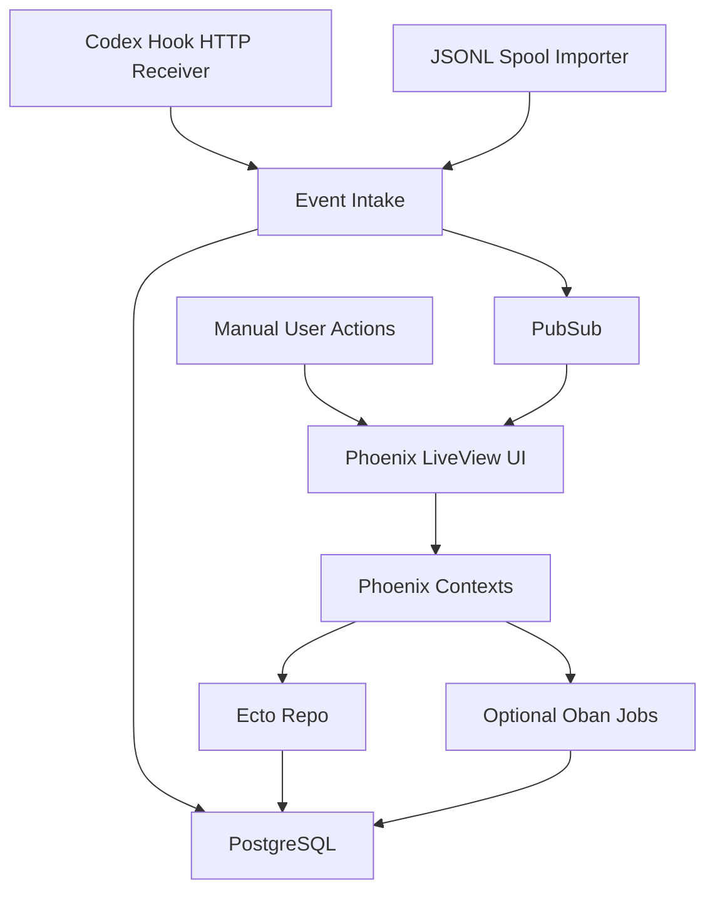
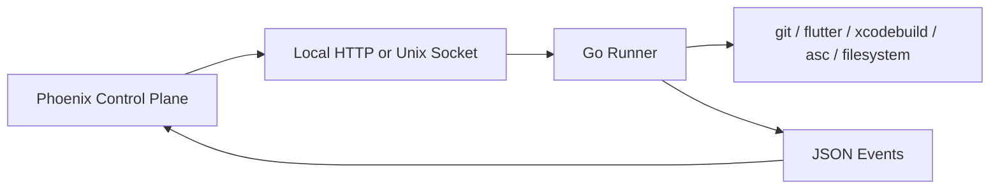

# One-Person App Factory Control Plane PRD

> Canonical development PRD for the Phoenix + PostgreSQL MVP.

## 0. Decision Summary

This document replaces the previous exploratory PRD and is the canonical
implementation PRD for the MVP.

### Product Decision

Build a local-first operating control plane for a one-person app factory. The
product coordinates app lifecycle state, next actions, lightweight tickets,
harness packets, Codex session visibility, release readiness, evidence, and
post-launch business posture.

### MVP Technology Decision

- Primary stack: Phoenix LiveView.
- Database: PostgreSQL.
- Background jobs: Oban if recurring or retryable jobs are needed in the MVP;
  otherwise supervised GenServer/Task flows are acceptable for the first slice.
- Codex integration: Codex hooks first, through local HTTP receiver and/or JSONL
  spool import.
- Codex app-server / JSON-RPC: deferred to later.
- Local system runner: not part of MVP. If command orchestration becomes
  complex, add a Go sidecar later for subprocess control, filesystem watching,
  and local command scheduling.

### MVP Goal

Within one minute, the operator must be able to answer:

- Which app needs attention now?
- Why does it need attention?
- What is the next action?
- Which ticket or harness packet owns that work?
- Is a Codex session already working on it?
- What evidence is required before the app, ticket, or release state advances?

## 1. Product Thesis

### Problem

A one-person app factory can have many apps in different states at the same
time: ideas, validation work, build work, release preparation, submitted builds,
live apps, growth experiments, maintenance, and bug fixes. Codex can execute
work across many repositories, but the operator still needs to know which app is
in which state, which task is next, which Codex session is doing what, and what
proof is needed before a decision can be made.

Generic project management tools track tasks, but they do not understand app
lifecycle gates, release readiness, evidence, or Codex session linkage. Agent
orchestration tools can become too heavy before the daily operating loop is
proven.

### Product Promise

Provide a dense local command center that lets the operator coordinate a
portfolio of apps across lifecycle, execution, release, growth, and maintenance
without losing ownership of decisions.

### Product Positioning

This is not a generic Kanban board. It is a local-first lifecycle and execution
control plane for a one-person app factory.

### Product Principles

- App lifecycle first, tickets second.
- Human confirmation for state transitions and risky work.
- Harness packets define executable work; tickets track workflow state.
- Evidence is required before meaningful advancement.
- Codex sessions are observed and linked, not treated as automatically correct.
- Business outcomes matter: release throughput only matters if it improves
  demand validation, distribution, conversion, retention, revenue, or
  maintenance efficiency.
- PostgreSQL is the application source of truth.
- External tools are integrations, not the source of truth.
- Keep the MVP dogfoodable and narrow; do not build a full agent orchestrator.

## 2. Target User

### Primary User

Ewan, operating a portfolio of small app projects with Codex as an execution
assistant.

### Operating Context

- Many local app repositories may be active at once.
- Multiple Codex sessions may run in parallel.
- A single day may include release preparation for one app, bug fixes for
  another, validation for a third, and growth work for a live app.
- The operator wants a single surface to decide what to do next.
- The operator wants to manually confirm next actions, Codex launches, review
  decisions, and app lifecycle transitions.

## 3. Scope

### MVP Scope

The MVP must include:

- App inventory with repository path and lifecycle state.
- Today Command Center.
- App detail cockpit.
- Lightweight tickets.
- Minimal harness packet builder.
- Codex session event intake through hook receiver or JSONL spool import.
- Session inbox and ticket/session linking.
- Manual session review.
- Evidence packets.
- Release targets and release checklist.
- Minimal business snapshot and live app posture.
- Settings for repository roots and Codex hook intake.
- PostgreSQL persistence.

### MVP Non-Goals

The MVP must not include:

- Autonomous agent orchestration.
- Automatic lifecycle transitions.
- Mandatory transcript ingestion.
- Full Codex app-server client behavior.
- App Store Connect or Play Console API integration.
- Revenue analytics automation.
- Multi-user collaboration.
- Desktop packaging.
- Go sidecar runner.
- Full opportunity pipeline automation.
- Full maintenance automation.

### V1 After MVP

Likely V1 features:

- Oban-backed recurring jobs and checks.
- Repository scanner for branch, dirty state, latest commit, and platform.
- Optional Codex app-server / JSON-RPC integration.
- Growth experiment board.
- Maintenance queue.
- Manual import helpers for App Store Connect, Play Console, analytics, or
  RevenueCat exports.
- Optional Go sidecar for local command execution.

## 4. Core Concepts

### App

A product in the app factory. Usually maps to one local repository. An app has
a lifecycle stage, business posture, next action, active tickets, release
targets, sessions, and evidence.

### Lifecycle Stage

The app-level production state. This is separate from ticket state and session
state.

Allowed MVP values:

- `idea`
- `validation_ready`
- `validation_sprint`
- `build_ready`
- `in_build`
- `release_ready`
- `submitted`
- `live`
- `iterating`
- `maintained`
- `paused`
- `archived`

### Business Posture

The current business operating posture for a live or near-live app.

Allowed MVP values:

- `unknown`
- `grow`
- `maintain`
- `fix`
- `harvest`
- `pause`
- `kill`

### Ticket

A lightweight app-owned work item. Tickets are not a replacement for GitHub
Issues, Linear, or Jira. They exist to coordinate app-factory work, Codex
sessions, harness packets, evidence, and review.

Allowed MVP states:

- `backlog`
- `ready`
- `active`
- `review`
- `blocked`
- `done`
- `dropped`

### Harness Packet

The executable work contract. A ticket tracks workflow state; a harness packet
defines what should be done, with what context, under what constraints, how it
will be verified, what evidence is required, and who confirms the result.

Allowed MVP states:

- `draft`
- `ready`
- `launched`
- `observing`
- `review`
- `routed`
- `superseded`

### Codex Session

A detected or manually entered Codex work session. It can be linked to an app
and optionally to a ticket/harness packet.

Allowed MVP states:

- `detected`
- `linked`
- `running`
- `waiting`
- `stopped`
- `reviewed`
- `ignored`

### Evidence Packet

Proof or context attached to an app, ticket, harness packet, release target, or
session. Evidence can be manual text, local file path, URL, command log,
summary, screenshot path, metadata diff, validation note, or review note.

### Release Target

A planned release for an app and platform. It holds version/build information,
checklist items, status, evidence, and manual submission/live decisions.

Allowed MVP states:

- `draft`
- `preparing`
- `ready_for_review`
- `submitted`
- `live`
- `blocked`
- `cancelled`

### Metrics Snapshot

A dated manual record of business signals for an app, such as downloads,
impressions, conversion, revenue, rating, support issues, or notes.

### Event

Append-only record of something that happened. Events are used for session
intake, audit trail, UI refresh, and debugging.

## 5. Architecture

### MVP Architecture



### Later Go Runner Architecture

The Go runner is deferred. If added, it must be a local system sidecar with a
strict boundary:



The Go runner must not own product state. It should only execute local system
work, stream logs, report status, and accept cancellation.

### Phoenix Context Boundaries

Recommended contexts:

- `Factory.Portfolio`: apps, lifecycle, business posture, next actions.
- `Factory.Work`: tickets, harness packets, review decisions.
- `Factory.Sessions`: Codex sessions, hook events, session links.
- `Factory.Evidence`: evidence packets and attachments.
- `Factory.Releases`: release targets and checklist items.
- `Factory.Metrics`: metrics snapshots and business notes.
- `Factory.Settings`: repository roots, intake settings, integration settings.
- `Factory.Events`: append-only event log and event broadcasting.

### Real-Time Behavior

Use Phoenix PubSub to refresh LiveViews when:

- A hook event is received.
- A session changes state.
- A ticket enters review.
- Evidence is attached.
- A release checklist item changes.
- An app next action or lifecycle state changes.

### Background Jobs

MVP may start without Oban if all workflows are manual and hook-driven. Add Oban
when any of these are needed:

- Scheduled JSONL spool import.
- Recurring stale app checks.
- Recurring release readiness reminders.
- Retryable repository scans.
- Deferred evidence processing.

Oban is preferred over ad hoc timers for durable scheduled or retryable work
because jobs are stored in PostgreSQL and can be inspected.

## 6. User Experience Requirements

### Visual Direction

- Dense operational desktop UI.
- No marketing hero.
- No decorative nested cards.
- Tables, split panes, drawers, compact chips, and clear filters.
- Cards only for repeated task/evidence/session objects where useful.
- Status text must always accompany color.
- All text must fit in compact layouts without overlap.
- Buttons should use icons for common actions and labels for ambiguous actions.

### Interaction Direction

- Keyboard-friendly create/search/filter.
- Manual confirmation for lifecycle transitions, release transitions, and
  high-risk harness packets.
- Drag/drop is optional; explicit move actions are required.
- Every recommended next action must show its reason.
- The user must be able to ignore a Codex session without deleting evidence.
- The system must never mark a ticket done merely because a Codex session
  stopped.

## 7. Information Architecture

Primary navigation:

- Today
- Apps
- Board
- Sessions
- Releases
- Evidence
- Metrics
- Settings

Secondary app navigation:

- Overview
- Tickets
- Harness
- Sessions
- Release
- Evidence
- Metrics
- Notes

## 8. Screens And Acceptance Criteria

### 8.1 Today Command Center

Purpose: decide what to do next across the app factory.

Required modules:

- Focus queue.
- Apps needing review.
- Active Codex sessions.
- Unlinked Codex sessions.
- Release blockers.
- Stale apps without next action.
- Live apps with business posture needing attention.
- Quick create ticket/harness packet.

Acceptance criteria:

- The screen loads with all active apps grouped by urgency.
- The top focus item always links to an app and either a ticket, session,
  release target, or missing next action.
- Stopped sessions appear in a review queue, not as completed work.
- Blocked apps are visible even when filters are active.
- Each recommended item shows a reason such as "stopped session", "release
  blocker", "stale next action", "missing evidence", or "business posture fix".
- The user can create a ticket from any focus item.

### 8.2 App Portfolio

Purpose: scan all apps and their current operating state.

Required modules:

- Table of apps.
- Lifecycle stage.
- Business posture.
- Health state.
- Repository path.
- Platform.
- Next action.
- Active ticket count.
- Active session count.
- Current release target.
- Last activity.
- Filters by lifecycle, posture, health, platform, and stale state.

Acceptance criteria:

- At least twenty apps remain scannable on a laptop screen.
- The user can sort by lifecycle, business posture, blocked state, release
  readiness, and last activity.
- An app without next action is visibly marked.
- A missing or invalid repository path is visibly marked.
- Opening an app preserves the previous portfolio filter state when returning.

### 8.3 App Detail Cockpit

Purpose: recover context for one app.

Required modules:

- App identity and repository path.
- Lifecycle stage and manual transition action.
- Business posture and manual transition action.
- Product thesis fields.
- Next action.
- Active tickets.
- Active sessions.
- Current release target.
- Recent evidence.
- Recent metrics snapshot.
- Blockers.

Acceptance criteria:

- The user can understand what the app is, what state it is in, and what should
  happen next without opening another page.
- Lifecycle state, ticket state, and session state are visually separate.
- Lifecycle transitions require an explicit note.
- Business posture changes require an explicit note.
- The user can create a ticket, harness packet, evidence packet, release target,
  or metrics snapshot from the app page.

### 8.4 Ticket Board

Purpose: manage app-owned work.

Required modules:

- Columns: backlog, ready, active, review, blocked, done, dropped.
- App filter.
- Lifecycle gate filter.
- Business posture filter.
- Ticket cards with app, title, state, risk, linked sessions, evidence count,
  and review status.
- Explicit move menu.
- Ticket detail drawer.

Acceptance criteria:

- Ticket movement is manual.
- Moving to `done` requires a review note or linked evidence.
- Moving to `blocked` requires a blocked reason.
- A ticket can link to multiple sessions and evidence packets.
- A ticket can have one active harness packet and historical superseded
  packets.
- A stopped linked session moves the ticket into review prompt state but does
  not automatically mark it done.

### 8.5 Harness Packet Builder

Purpose: turn a next action into an executable work contract.

Required fields:

- App.
- Repository path.
- Ticket.
- Lifecycle gate or release target.
- Objective.
- Context inputs.
- Constraints.
- Non-goals.
- Allowed tools.
- Risk level.
- Expected output.
- Verification plan.
- Required evidence.
- Human approval points.
- Launch mode.
- Review route.

Acceptance criteria:

- The user cannot mark a packet ready without app, objective, expected output,
  and review route.
- A packet linked to a repository-backed app auto-populates repository path.
- High-risk packets require explicit confirmation before launch or linking.
- A packet can be created from a ticket, release blocker, stopped session,
  missing evidence item, stale app, or manual quick create.
- The packet preview is readable before the user starts work.
- The system records packet state changes in the event log.

### 8.6 Session Bridge

Purpose: make Codex work legible across repositories and tickets.

Required modules:

- Session inbox.
- Sessions grouped by app/repository.
- Unlinked sessions.
- Session detail drawer.
- Link to app.
- Link to ticket.
- Mark ignored.
- Mark reviewed.
- Optional transcript path display.
- Optional summary field.

Acceptance criteria:

- A hook event with `cwd` matching an app repository suggests that app.
- A hook event without matching repository appears in unlinked sessions.
- The user can link an unlinked session to an existing app and ticket.
- The user can create a new ticket from an unlinked session.
- Marking a session ignored does not delete the event record.
- A stopped linked session creates a review prompt.
- Transcript ingestion is not required for the session to be useful.

### 8.7 Release Center

Purpose: show what remains before an app can ship.

Required modules:

- Release target list.
- Release target detail.
- Version/build/platform.
- Checklist items.
- Missing evidence.
- Blockers.
- Submission status.
- Manual state transition.

MVP checklist categories:

- Build.
- Tests.
- Screenshots.
- Store metadata.
- Privacy.
- Localization.
- Release notes.
- Submission.
- Post-release follow-up.

Acceptance criteria:

- A release target cannot move to `ready_for_review` unless required checklist
  items are passed, waived, or explicitly marked not applicable.
- Waived checklist items require a reason.
- Moving to `submitted` requires a note.
- Moving to `live` requires a note and released date.
- A failed checklist item can create a ticket/harness packet.
- Evidence can be attached to each checklist item.

### 8.8 Evidence Store

Purpose: preserve proof for decisions.

Required modules:

- Evidence list.
- Evidence detail.
- Evidence type.
- Primary app.
- Optional ticket, harness packet, session, release target, or checklist link.
- Source path.
- Source URL.
- Summary.
- Reliability.
- Created date.

Acceptance criteria:

- Evidence can be created manually.
- Evidence can link to multiple objects but must have one primary app.
- Evidence source path and URL are optional, but summary is required.
- Evidence can be attached during ticket review and release checklist review.
- Deleting an evidence link does not delete the evidence packet unless the user
  explicitly deletes the packet.

### 8.9 Metrics Snapshot

Purpose: capture minimal post-launch business signals.

Required fields:

- App.
- Snapshot date.
- Downloads.
- Impressions.
- Product page views.
- Conversion rate.
- Revenue.
- Trials or subscriptions if applicable.
- Rating.
- Reviews count.
- Crashes.
- Support issues.
- Notes.

Acceptance criteria:

- A metrics snapshot can be saved with only app, date, and notes.
- Numeric fields accept blank values.
- The app detail page shows the latest snapshot.
- The Today page can flag live apps with no recent snapshot.
- Metrics are manual in MVP; no external analytics integration is required.

### 8.10 Settings

Purpose: configure local operation.

Required modules:

- Repository roots.
- Codex hook intake mode.
- JSONL spool path.
- Local HTTP hook receiver status.
- Privacy settings for transcript path display.
- Evidence storage conventions.
- Integration notes.

Acceptance criteria:

- The user can add repository roots.
- The system can match apps by repository path under configured roots.
- The user can enable or disable transcript path display.
- The user can choose HTTP hook intake, JSONL spool intake, both, or neither.
- Integration errors are visible and actionable.

## 9. Core User Scenarios

### Scenario 1: Start The Day

User goal: decide what to work on first.

Flow:

1. User opens Today.
2. System shows focus queue, review queue, unlinked sessions, release blockers,
   and stale apps.
3. User selects a focus item.
4. User opens the linked app/ticket/session/release item.
5. User decides the next action.

Acceptance criteria:

- Given at least one stopped linked session, Today shows it in review queue.
- Given at least one release target with failed checks, Today shows it as a
  release blocker.
- Given an active app without next action for more than the configured stale
  threshold, Today shows it as stale.
- Given no urgent items, Today still shows active apps and their next actions.

### Scenario 2: Add An App

User goal: add a local app project to the portfolio.

Flow:

1. User clicks Add App.
2. User enters name, repository path, platform, lifecycle stage, and optional
   product thesis.
3. System validates repository path.
4. User saves.
5. App appears in portfolio and Today when relevant.

Acceptance criteria:

- App name is required.
- Repository path is optional for pre-repository ideas but required for Codex
  cwd matching.
- Duplicate repository paths are rejected unless the user explicitly edits the
  existing app.
- Invalid repository paths are saved only with warning state.

### Scenario 3: Define Next Action

User goal: make an app actionable.

Flow:

1. User opens app detail.
2. User edits next action.
3. User optionally creates a ticket from next action.
4. System updates Today and portfolio.

Acceptance criteria:

- Active apps without next action are flagged.
- Creating a ticket from next action copies app, title, lifecycle gate, and
  default status.
- Changing next action creates an event.

### Scenario 4: Create A Harness Packet

User goal: prepare a bounded task for Codex or human execution.

Flow:

1. User opens ticket or app.
2. User clicks Create Harness Packet.
3. User fills objective, context, constraints, expected output, verification,
   evidence, risk, and review route.
4. User saves draft or marks ready.

Acceptance criteria:

- Draft can be incomplete.
- Ready packet must pass required field validation.
- High-risk packet shows confirmation.
- Packet becomes visible on ticket detail.

### Scenario 5: Receive A Codex Hook Event

User goal: observe Codex work without manual bookkeeping.

Flow:

1. Codex hook posts event or writes JSONL.
2. System stores raw event.
3. System resolves cwd to app if possible.
4. System creates or updates Codex session.
5. Live UI updates.

Acceptance criteria:

- Raw event is stored even if session parsing fails.
- Duplicate hook events do not create duplicate sessions.
- Unknown cwd results in unlinked session.
- Matching cwd suggests app link.
- UI updates without page reload.

### Scenario 6: Link Session To Ticket

User goal: connect a Codex session to the work it is doing.

Flow:

1. User opens Session Bridge.
2. User selects session.
3. User links to app and ticket.
4. System updates session state and ticket detail.

Acceptance criteria:

- Linked session appears on ticket and app detail.
- Linking requires app.
- Linking to ticket is optional but recommended.
- Link action creates event.

### Scenario 7: Review Completed Session

User goal: decide whether Codex work should advance the ticket.

Flow:

1. Session stops.
2. System prompts review.
3. User reviews summary, transcript path, notes, diff evidence, or manual
   result.
4. User records decision: pass, needs work, blocked, reject.
5. System routes ticket accordingly.

Acceptance criteria:

- Stopped session never auto-completes ticket.
- Pass requires review note or evidence.
- Needs work can create follow-up harness packet.
- Blocked requires blocked reason.
- Reject can mark packet superseded or ticket dropped.

### Scenario 8: Prepare Release

User goal: move an app toward submission.

Flow:

1. User creates release target.
2. User works through checklist.
3. User attaches evidence.
4. User creates tickets for failed checks.
5. User manually moves release target through states.

Acceptance criteria:

- Release target requires app, platform, and version or label.
- Required checklist items must be passed, waived, or not applicable before
  ready_for_review.
- Waiver requires reason.
- State transition creates event.

### Scenario 9: Attach Evidence

User goal: preserve proof for a decision.

Flow:

1. User opens ticket, release checklist, session, or app.
2. User clicks Add Evidence.
3. User enters type, summary, optional path/URL, and reliability.
4. System attaches evidence.

Acceptance criteria:

- Evidence summary is required.
- Evidence can be created without local file path.
- Evidence appears on related object and app evidence timeline.
- Evidence creation creates event.

### Scenario 10: Capture Business Snapshot

User goal: record post-launch business state.

Flow:

1. User opens live app.
2. User adds metrics snapshot.
3. User optionally changes business posture.
4. System updates portfolio and Today.

Acceptance criteria:

- Snapshot date defaults to today.
- Blank numeric metrics are allowed.
- Business posture change requires note.
- Today can flag live apps with stale or missing snapshot.

### Scenario 11: Pause Or Archive App

User goal: reduce attention cost for low-value apps.

Flow:

1. User opens app detail.
2. User chooses pause or archive lifecycle state.
3. User enters reason.
4. System removes app from active focus unless filters include paused/archived.

Acceptance criteria:

- Pause/archive requires reason.
- Paused apps can still keep tickets and evidence.
- Archived apps are hidden by default but searchable.
- State transition creates event.

### Scenario 12: Configure Hook Intake

User goal: connect Codex events.

Flow:

1. User opens Settings.
2. User enables HTTP hook receiver or JSONL spool path.
3. User copies setup hint.
4. System shows intake health.

Acceptance criteria:

- HTTP receiver has a local-only binding by default.
- JSONL path validation checks readability.
- Intake errors are shown.
- Disabling intake does not delete existing events.

### Scenario 13: Recover Context After Interruption

User goal: resume work after context switching.

Flow:

1. User opens app detail or ticket.
2. System shows latest sessions, evidence, current packet, release target, and
   next action.
3. User continues or creates next packet.

Acceptance criteria:

- App detail includes recent evidence and sessions.
- Ticket detail includes packet, linked sessions, review state, and evidence.
- User can resume without reading old Codex chats by default.

## 10. Data Model

### PostgreSQL Notes

- Use UUID primary keys unless there is a strong reason not to.
- Use `utc_datetime_usec` timestamps.
- Use PostgreSQL `jsonb` for structured flexible packet fields.
- Use check constraints or Ecto enum validation for controlled states.
- Keep an append-only `events` table.
- Use soft archival states rather than destructive deletes for core records.

### Tables

#### `apps`

- `id uuid primary key`
- `name text not null`
- `slug text not null unique`
- `repo_path text`
- `platforms text[] not null default '{}'`
- `lifecycle_stage text not null`
- `business_posture text not null default 'unknown'`
- `health_state text not null default 'unknown'`
- `product_thesis jsonb not null default '{}'`
- `next_action text`
- `current_version text`
- `current_build text`
- `last_activity_at timestamptz`
- `paused_reason text`
- `archived_at timestamptz`
- `inserted_at timestamptz not null`
- `updated_at timestamptz not null`

Indexes:

- unique index on `slug`
- index on `repo_path`
- index on `lifecycle_stage`
- index on `business_posture`
- index on `last_activity_at`

#### `tickets`

- `id uuid primary key`
- `app_id uuid not null references apps(id)`
- `title text not null`
- `description text`
- `status text not null default 'backlog'`
- `lifecycle_gate text`
- `priority text not null default 'normal'`
- `risk_level text not null default 'normal'`
- `blocked_reason text`
- `review_note text`
- `done_at timestamptz`
- `dropped_at timestamptz`
- `inserted_at timestamptz not null`
- `updated_at timestamptz not null`

Indexes:

- index on `app_id`
- index on `status`
- index on `lifecycle_gate`

#### `harness_packets`

- `id uuid primary key`
- `app_id uuid not null references apps(id)`
- `ticket_id uuid references tickets(id)`
- `release_target_id uuid references release_targets(id)`
- `state text not null default 'draft'`
- `objective text not null`
- `context_inputs jsonb not null default '{}'`
- `constraints jsonb not null default '{}'`
- `non_goals jsonb not null default '[]'`
- `allowed_tools jsonb not null default '[]'`
- `risk_level text not null default 'normal'`
- `expected_output text`
- `verification_plan jsonb not null default '{}'`
- `required_evidence jsonb not null default '[]'`
- `approval_points jsonb not null default '[]'`
- `launch_mode text not null default 'manual'`
- `review_route text`
- `result_summary text`
- `next_route text`
- `superseded_at timestamptz`
- `inserted_at timestamptz not null`
- `updated_at timestamptz not null`

Indexes:

- index on `app_id`
- index on `ticket_id`
- index on `state`
- index on `risk_level`

#### `codex_sessions`

- `id uuid primary key`
- `external_session_id text not null`
- `app_id uuid references apps(id)`
- `cwd text`
- `model text`
- `status text not null default 'detected'`
- `transcript_path text`
- `latest_turn_id text`
- `summary text`
- `first_seen_at timestamptz`
- `last_seen_at timestamptz`
- `stopped_at timestamptz`
- `reviewed_at timestamptz`
- `ignored_at timestamptz`
- `inserted_at timestamptz not null`
- `updated_at timestamptz not null`

Indexes:

- unique index on `external_session_id`
- index on `app_id`
- index on `cwd`
- index on `status`

#### `ticket_session_links`

- `id uuid primary key`
- `ticket_id uuid not null references tickets(id)`
- `codex_session_id uuid not null references codex_sessions(id)`
- `link_reason text`
- `inserted_at timestamptz not null`

Indexes:

- unique index on `ticket_id, codex_session_id`
- index on `codex_session_id`

#### `evidence_packets`

- `id uuid primary key`
- `app_id uuid not null references apps(id)`
- `type text not null`
- `title text not null`
- `summary text not null`
- `source_path text`
- `source_url text`
- `reliability text not null default 'unknown'`
- `payload jsonb not null default '{}'`
- `inserted_at timestamptz not null`
- `updated_at timestamptz not null`

Indexes:

- index on `app_id`
- index on `type`
- index on `inserted_at`

#### `evidence_links`

- `id uuid primary key`
- `evidence_packet_id uuid not null references evidence_packets(id)`
- `subject_type text not null`
- `subject_id uuid not null`
- `link_reason text`
- `inserted_at timestamptz not null`

Indexes:

- index on `evidence_packet_id`
- index on `subject_type, subject_id`

#### `release_targets`

- `id uuid primary key`
- `app_id uuid not null references apps(id)`
- `platform text not null`
- `label text`
- `version text`
- `build text`
- `status text not null default 'draft'`
- `submitted_at timestamptz`
- `released_at timestamptz`
- `decision_note text`
- `inserted_at timestamptz not null`
- `updated_at timestamptz not null`

Indexes:

- index on `app_id`
- index on `status`
- index on `platform`

#### `release_check_items`

- `id uuid primary key`
- `release_target_id uuid not null references release_targets(id)`
- `category text not null`
- `title text not null`
- `status text not null default 'pending'`
- `required boolean not null default true`
- `waiver_reason text`
- `decision_note text`
- `position integer not null default 0`
- `updated_by text`
- `inserted_at timestamptz not null`
- `updated_at timestamptz not null`

Indexes:

- index on `release_target_id`
- index on `status`
- index on `category`

#### `metrics_snapshots`

- `id uuid primary key`
- `app_id uuid not null references apps(id)`
- `snapshot_date date not null`
- `downloads integer`
- `impressions integer`
- `product_page_views integer`
- `conversion_rate numeric`
- `revenue numeric`
- `trials integer`
- `subscriptions integer`
- `refunds integer`
- `rating numeric`
- `reviews_count integer`
- `crashes integer`
- `support_issues integer`
- `notes text`
- `payload jsonb not null default '{}'`
- `inserted_at timestamptz not null`
- `updated_at timestamptz not null`

Indexes:

- index on `app_id`
- index on `snapshot_date`

#### `hook_events`

- `id uuid primary key`
- `external_session_id text`
- `event_name text not null`
- `cwd text`
- `model text`
- `transcript_path text`
- `turn_id text`
- `payload jsonb not null default '{}'`
- `received_at timestamptz not null`
- `processed_at timestamptz`
- `processing_error text`

Indexes:

- index on `external_session_id`
- index on `received_at`
- index on `processed_at`

#### `events`

- `id uuid primary key`
- `subject_type text not null`
- `subject_id uuid`
- `event_type text not null`
- `payload jsonb not null default '{}'`
- `inserted_at timestamptz not null`

Indexes:

- index on `subject_type, subject_id`
- index on `event_type`
- index on `inserted_at`

#### `settings`

- `id uuid primary key`
- `key text not null unique`
- `value jsonb not null default '{}'`
- `inserted_at timestamptz not null`
- `updated_at timestamptz not null`

## 11. State Rules

### Ticket State Rules

- `backlog` can move to `ready`, `active`, `blocked`, or `dropped`.
- `ready` can move to `active`, `blocked`, `done`, or `dropped`.
- `active` can move to `review`, `blocked`, `done`, or `dropped`.
- `review` can move to `active`, `blocked`, `done`, or `dropped`.
- `blocked` can move to `ready`, `active`, `done`, or `dropped`.
- `done` can reopen to `ready` only with a note.
- `dropped` can reopen to `backlog` only with a note.

### Session State Rules

- Hook intake can create `detected`.
- Linked app/ticket can move `detected` to `linked`.
- Start/running hook can move to `running`.
- Stop event can move to `stopped`.
- User review can move to `reviewed`.
- User ignore can move to `ignored`.

### Release State Rules

- `draft` can move to `preparing` or `cancelled`.
- `preparing` can move to `ready_for_review`, `blocked`, or `cancelled`.
- `ready_for_review` can move to `submitted`, `blocked`, or `preparing`.
- `submitted` can move to `live` or `blocked`.
- `blocked` can move to `preparing`, `ready_for_review`, or `cancelled`.
- `live` is final for that release target.

## 12. Codex Hook Intake

### Accepted Payload

The hook receiver should accept a JSON payload with these fields when present:

- `session_id`
- `cwd`
- `hook_event_name`
- `model`
- `transcript_path`
- `turn_id`
- `timestamp`
- `payload`

Unknown fields must be preserved in `payload`.

### HTTP Receiver

Endpoint:

```text
POST /api/codex/hooks
```

MVP requirements:

- Bind to local-only host by default.
- Accept JSON.
- Store raw event before processing.
- Return success after durable storage.
- Process event synchronously if simple; otherwise enqueue background job.

### JSONL Spool Import

MVP requirements:

- Configurable spool path.
- Import append-only JSONL events.
- Preserve raw payload.
- Avoid duplicate import through event hash or offset tracking.

## 13. Privacy And Safety

### Privacy Requirements

- Do not read full Codex transcripts by default.
- Display transcript path only if the user enables it.
- Treat local repository paths as private data.
- Do not store external credentials.
- Do not send app, session, ticket, evidence, or metrics data to external
  services in MVP.

### Safety Requirements

- Lifecycle transitions require manual confirmation and note.
- Release transitions require manual confirmation and note.
- High-risk harness packets require confirmation.
- Session stop never implies task success.
- Evidence supports decisions but does not auto-advance state.
- Deleting core records should be avoided in MVP; prefer archive/ignore/drop
  states.

## 14. Development Plan

### Milestone 1: Phoenix Skeleton And PostgreSQL

Deliverables:

- Phoenix LiveView app created.
- PostgreSQL configured.
- Ecto repo and migrations.
- Basic layout and navigation.
- Context boundaries created.

Acceptance criteria:

- `mix test` passes.
- App boots locally.
- PostgreSQL migrations run cleanly.
- Navigation includes Today, Apps, Board, Sessions, Releases, Evidence, Metrics,
  and Settings.

### Milestone 2: App Inventory And Today

Deliverables:

- App CRUD.
- Portfolio table.
- App detail cockpit.
- Today Command Center with static query-based queues.

Acceptance criteria:

- User can create/edit/archive app.
- App appears in portfolio and app detail.
- Today shows apps without next action and apps needing attention.

### Milestone 3: Tickets And Harness Packets

Deliverables:

- Ticket CRUD.
- Ticket board.
- Harness packet builder.
- State transitions with notes.

Acceptance criteria:

- User can create ticket from app.
- User can create packet from ticket.
- Required packet validation works.
- Ticket done/blocked transitions enforce required notes/evidence rules.

### Milestone 4: Codex Session Bridge

Deliverables:

- Hook event endpoint.
- Hook event storage.
- Session creation/update.
- Cwd-to-app matching.
- Session inbox and linking.
- Review prompts.

Acceptance criteria:

- POSTing a hook payload creates hook event and session.
- Matching cwd links/suggests app.
- Stopped linked session appears in review queue.
- User can link, ignore, and review session.

### Milestone 5: Evidence And Release Center

Deliverables:

- Evidence CRUD.
- Evidence links.
- Release targets.
- Release checklist.
- Checklist evidence attachment.

Acceptance criteria:

- User can create release target.
- Default checklist appears.
- Checklist item can pass/fail/waive.
- Release ready state enforces checklist rules.

### Milestone 6: Business Snapshot

Deliverables:

- Metrics snapshot form.
- Business posture on app.
- Latest metrics on app detail.
- Today flags live apps without recent snapshot.

Acceptance criteria:

- User can create snapshot with partial metrics.
- User can change business posture with note.
- Portfolio shows posture.
- Today flags stale live app metrics.

## 15. Testing Strategy

### Unit Tests

- Ecto changesets validate required fields.
- State transition functions enforce rules.
- Hook parser preserves unknown payload fields.
- Cwd matching selects correct app.
- Release readiness logic handles passed, failed, waived, and not applicable
  checklist items.

### Context Tests

- Creating app updates events.
- Creating ticket from next action works.
- Creating harness packet from ticket works.
- Linking session to ticket works.
- Reviewing session routes ticket correctly.
- Attaching evidence to multiple subjects works.

### LiveView Tests

- Today renders focus queues.
- App portfolio filters and sorts.
- App detail shows separate lifecycle/ticket/session state.
- Ticket board moves tickets with required validation.
- Harness packet builder validates required fields.
- Session inbox links and ignores sessions.
- Release center enforces checklist readiness.

### Integration Tests

- HTTP Codex hook creates hook event and session.
- Duplicate hook event does not duplicate session.
- Stopped session appears in review queue.
- Evidence attached during review appears in app timeline.

### Manual Dogfood Test

Use at least five real local app repositories:

- Add each app.
- Assign lifecycle state and next action.
- Create one ticket per app.
- Create one harness packet.
- Send one fake Codex hook event.
- Link one session.
- Review one stopped session.
- Create one release target.
- Attach one evidence packet.
- Create one metrics snapshot for a live app.

MVP is not accepted until this dogfood test is completed.

## 16. Definition Of Done

The MVP is done when:

- The user can run the Phoenix app locally.
- PostgreSQL is the only database source of truth.
- At least five real apps can be managed.
- Today page answers the next-action question within one minute.
- Codex hook event intake works with fake and real events.
- Session linking and stopped-session review work.
- Tickets and harness packets are separate but linked.
- Release checklist blocks premature ready/submitted/live transitions.
- Evidence can be attached to decisions.
- Live app business posture and manual metrics snapshot work.
- Core flows have automated tests.
- Privacy defaults avoid transcript ingestion.

## 17. Open Questions

- What exact Phoenix app name and repository path should be used? This repo.
- Should the MVP use Oban immediately or only after hook/spool intake needs
  retryable jobs? Yes, use Oban
- What stale thresholds should be used for apps, sessions, releases, and
  metrics snapshots?
- Should lifecycle stage and business posture be PostgreSQL enums or text fields
  with Ecto validation for easier early iteration? You choose one.
- Should release checklist templates vary by platform in MVP or start with one
  generic checklist? Yes.
- Should the first hook receiver require a local shared secret? What kind of secret you need it?

## 18. Implementation References

Official implementation references to use during development:

- [Phoenix LiveView](https://hexdocs.pm/phoenix_live_view/Phoenix.LiveView.html)
  for server-rendered realtime UI.
- [Phoenix Contexts](https://hexdocs.pm/phoenix/contexts.html) for context and
  module boundaries.
- [Ecto PostgreSQL adapter](https://hexdocs.pm/ecto_sql/Ecto.Adapters.Postgres.html)
  for PostgreSQL persistence.
- [Postgrex](https://hexdocs.pm/postgrex/Postgrex.html) for the PostgreSQL
  driver.
- [Oban](https://hexdocs.pm/oban/Oban.html) if the MVP needs durable background
  jobs.

---
