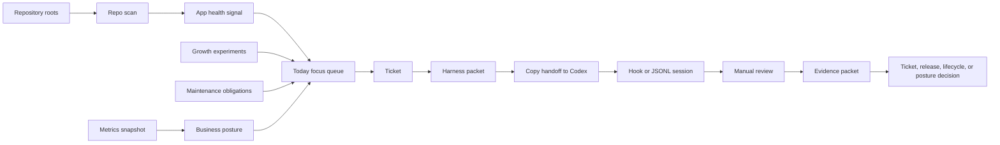

<!-- If files in this folder change, update this document. -->

# Phase 2 Dogfood Operating Loop

Phase 2 turns the MVP from a set of control-plane records into a daily operating
loop. It keeps the same local-first boundary: the app observes repositories,
Codex sessions, evidence, releases, and business posture, but it does not
autonomously mutate external app projects or mark work complete without review.

## Scope

- Repository scanning for configured roots and app repository paths.
- Harness handoff text that can be copied into Codex or another executor.
- Review-time evidence capture for stopped Codex sessions.
- Lifecycle and business posture transitions with optional evidence capture.
- Growth experiment review queue for live or near-live apps.
- Maintenance obligation queue for operational work.
- Oban-backed repository root scan jobs.

## Non-Goals

- Autonomous Codex orchestration.
- Automatic app lifecycle transitions.
- Mandatory transcript ingestion.
- App Store Connect, Play Console, RevenueCat, or analytics API integration.
- Mutating user app repositories during dogfood verification.

## Operating Flow

## Verification Contract

Phase 2 is considered working when:

- A temporary git repository can be scanned and matched to an app without
  touching existing user app repositories.
- Dirty or missing repositories appear as attention items.
- A harness packet exposes copyable handoff text and can be marked launched.
- A stopped Codex session can be reviewed with evidence summary, creating
  evidence links for both session and ticket.
- Due growth experiments and maintenance obligations appear in Today.
- `mix precommit` passes.
